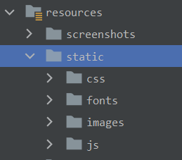
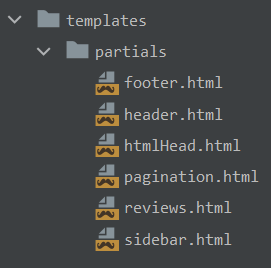
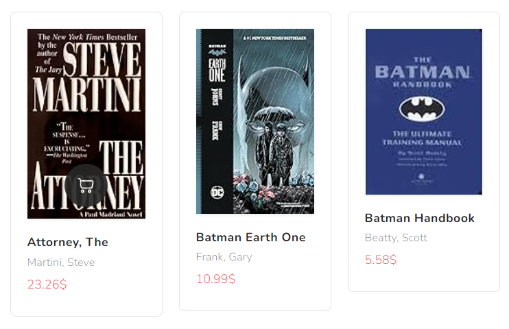

# Spring Boot course

This project is meant to teach Spring Boot fundamentals by creating a book shop, step by step. <br/>
It uses the [Spring Boot](https://docs.spring.io/spring-boot/docs/current/reference/html/getting-started.html) framework, a [Bootstrap 5](https://getbootstrap.com) frontend and stores its data in [CSV](https://en.wikipedia.org/wiki/Comma-separated_values) files.

This is how the final shop looks like:

<br/>
<br/>

Follow these steps to implement the book shop:
## 1. Create project
1. In your IDE, create a new Spring Initializr project:<br/>
   
  

2. Wait until all files and folders are created. After that, add these dependencies to your [pom.xml](pom.xml) file: 
   ```xml
   <dependencies>
      <dependency>
         <groupId>org.springframework.boot</groupId>
         <artifactId>spring-boot-starter-mustache</artifactId>
         <version>3.2.1</version>
      </dependency>
      <dependency>
         <groupId>org.springframework.boot</groupId>
         <artifactId>spring-boot-starter-web</artifactId>
         <version>3.2.1</version>
      </dependency>
      <dependency>
         <groupId>org.springframework.boot</groupId>
         <artifactId>spring-boot-devtools</artifactId>
         <version>3.2.1</version>
      </dependency>
   </dependencies>
   ```
   
3. In your [application.properties](src/main/resources/application.properties), add the app name and set the Mustache file suffix to `html`:
   ```properties
   spring.application.name=Book Shop
   spring.mustache.suffix=.html
   ```

## 2. Add static resources  
1. Under the [resources](src/main/resources) directory, create this folder structure for static web files:<br/>
   
  

2. Under the [static](src/main/resources/static) directory, add the HTML file templates. Add the other static files (CSS, scripts, fonts), as well.<br/>
     
  

3. In the [Shop](src/main/java/onlineshop/Shop.java) class, start the Spring Boot server.
   ```java
   @SpringBootApplication
   public class Shop {
      public static void main(String[] args) {
        SpringApplication.run(Shop.class, args);
      }
   }
   ```
   Open this URL in your Browser: http://localhost:8080 <br/>
   Your static [start page](http://localhost:8080/index.html) should appear.

## 3. Split the pages into partials
1. Under the [resources](src/main/resources) directory, create a [templates](src/main/resources/templates) folder.
1. Move the [index.html](src/main/resources/static/index.html) file from [static](src/main/resources/static) to the new [templates](src/main/resources/templates) folder.
1. Under templates, create a [partials](src/main/resources/templates/partials) folder. Your folder structure should look like this, now:

1. From the [index.html](src/main/resources/templates/index.html) file, cut out part of the HTML head section and paste it to a new [htmlHead.html](src/main/resources/templates/partials/htmlHead.html) file in partials:
   ```html
   <meta charset="utf-8">
   <meta http-equiv="X-UA-Compatible" content="IE=edge">
   <meta name="viewport" content="width=device-width, initial-scale=1.0">
   <link rel="icon" href="/images/favicon.ico" sizes="48x48">
   <link rel="stylesheet" type="text/css" href="/css/bootstrap.min.css">
   <link rel="stylesheet" type="text/css" href="/css/style.css">
   <link rel="stylesheet" type="text/css" href="/css/swiper-bundle.min.css"/>
   <link rel="preconnect" href="https://fonts.googleapis.com">
   <link rel="preconnect" href="https://fonts.gstatic.com" crossorigin>
   ```

1. In the [index](src/main/resources/templates/index.html) file, create a reference to the freshly create [htmlHead](src/main/resources/templates/partials/htmlHead.html) file.
   ```handlebars
   <!DOCTYPE html>
   <html>
   <head>
       <title>Overview</title>
       {{> partials/htmlHead }}
   </head>
   ```
1. Repeat these steps for [header](src/main/resources/templates/partials/header.html), [footer](src/main/resources/templates/partials/footer.html) and other page sections.

1. Your file structure should look like this, now:<br/>
   
1. Your HTML file shoud look like this:
   ```handlebars
   <!DOCTYPE html>
   <html>
   <head>
       <title>Overview</title>
       {{> partials/htmlHead }}
   </head>
   <body>
   {{> partials/header }}
   <section class="hero-section position-relative padding-small">
       ...
   </section>
   <div class="shopify-grid padding-small">
       ...
   </div>
   {{> partials/footer }}
   </body>
   </html>
   ```
1. Repeat these steps for all other HTML files: move them to the [templates](src/main/resources/templates) folder and replace their partials code by Mustache templates. No HTML files should remain in the [static](src/main/resources/static) folder.
  
## 4. Create a Controller
1. Create a Controller class named [ShopController.java](src/main/java/onlineshop/ShopController.java)
1. Give it a `@Controller` annotation.
1. Add a method to handle the root URL: "/"
1. Add a method to handle `.html` URLs. The result should look like this:
   ```java
   @Controller
   public class ShopController {
        @GetMapping(value = {"/"})
        public String root(Model model) {
            return "redirect:/index.html";
        }
   
        @GetMapping(value = {"/{name}.html"})
        public String htmlMapping(@PathVariable String name, HttpSession session) {
            return name;
        }
   }
   ```

## 5. Import and display articles
1. In the [resources](src/main/resources) directory, create a [CSV file](src/main/resources/books.csv) containing a list of articles or books. It could look like this:
   ```
   Title;Author;Genre;Pages;Publisher;Price;Image
   God Created the Integers;Hawking, Stephen;mathematics;197;Penguin;24,50;https://m.media-amazon.com/images/I/71HKbmRoVmL._AC_UY218_.jpg
   ```
2. In the  [Shop](src/main/java/onlineshop/Shop.java) class, create a `readArticles()` method that will read a CSV file and fill a [Book](src/main/java/onlineshop/merchandise/Book.java) list from it. Pass the `fileName` and `List` as parameters:
   ```java
   private static void readArticles(String fileName, List<Book> books) { ... }
   ```
   
3. Create a getter method so that we can access the article list from outside.
   ```java
   public static List<Book> getArticles() {
        return books;
   }
   ```
4. In [ShopController.homePage()](src/main/java/onlineshop/ShopController.java#L28), load the article list and pass it to the view model.
   ```java
   @GetMapping(value = {"/index.html"})
   public String homePage(Model model) {
        model.addAttribute("articles", Shop.getArticles());
        return "index";
   }
   ```
5. In the [index.html](src/main/resources/templates/index.html) template, iterate over the `articles`. Integrate the article fields in the proper HTML code section.
   ```handlebars
    <div class="row product-content product-store">
        {{#articles}}
            <div class="col-lg-3 col-md-4 mb-4">
                <div class="card position-relative p-4 border rounded-3">
                    
                    <h6 class="mt-4 mb-0 fw-bold"><a href="#">{{title}}</a></h6>
                    <div class="review-content d-flex">
                        <p class="my-2 me-2 fs-6 text-black-50">{{author}}</p>
                    </div>
                    <span class="price mb-2 text-primary">{{price}}$</span>
                    <div class="card-concern position-absolute start-0 end-0 d-flex gap-2">
                        <button type="button" href="#" class="btn btn-dark" data-bs-toggle="tooltip" 
                          data-bs-placement="top" data-bs-title="Tooltip on top">
                            <svg class="cart"><use xlink:href="#cart"></use></svg>
                        </button>
                    </div>
                </div>
            </div>
        {{/articles}}
    </div>
   ```
6. Check the result in your browser. The dynamic articles from the CSV file should appear on your homepage: http://localhost:8080. The result should look like this:<br/>
   